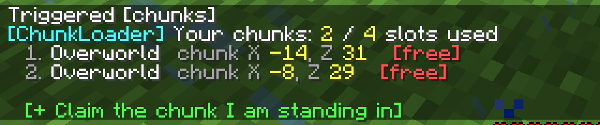

# Community Chunk Loader

[](https://github.com/wyzd0m/community-chunk-loader/actions/workflows/verify.yml)

A server-only Minecraft **1.21.1** datapack that gives every player a small,
bounded number of chunks that stay loaded while they are offline.

Built for a ~25-member NeoForge **Create** server where players were leaving
accounts AFK overnight so their farms would keep producing for the server
economy. This replaces that workaround with something the server owner can
measure and cap.

Players only need to remember one command:

```text
/trigger chunks set 1
```

...which prints their chunks as a clickable menu:



`[free]` releases that claim from anywhere in the world. The green button claims
the chunk the player is standing in. Both have typed equivalents
(`/trigger chunkadd set 1`, `/trigger chunkfree set 1`) for anyone who prefers
them - see [docs/COMMANDS.md](docs/COMMANDS.md).

- **No client mods.** Players install nothing.
- **No OP required.** Ordinary players manage their own chunks.
- **Survives logout, `/reload`, and full server restarts.**
- **Bounded.** 4 chunks per player by default, changeable live with one command.
- **Shared-chunk safe.** Two players can claim the same chunk; it only unloads
  when the last owner lets go.
- **Reversible.** One admin command releases everything the pack created.

## Status

**v1.2.0 is released and running on the server it was built for.** Commands and
menu, persistence across a full restart, and a Create farm processing with no
player nearby have all been confirmed live, with other members of the server
using it too.

Server performance was never formally benchmarked, and shared-chunk ownership
and the admin recovery paths have not been exercised end to end. Those gaps are
written up honestly in [`TEST_PLAN.md`](TEST_PLAN.md#10-results---v120-2026-08-31).

## Install

Drop the zip into `<world>/datapacks/` and restart the server. Full steps,
verification, and uninstall are in [`docs/INSTALL.md`](docs/INSTALL.md).

```powershell
.\build.ps1
```

Builds `dist/community-chunk-loader-v1.2.0.zip` from `pack/`.

## Documentation

| Document | What it covers |
|---|---|
| [`docs/INSTALL.md`](docs/INSTALL.md) | Installing, verifying, uninstalling |
| [`docs/COMMANDS.md`](docs/COMMANDS.md) | The chunk menu and typed commands |
| [`docs/ADMIN.md`](docs/ADMIN.md) | Admin functions, tuning, recovery |
| [`ARCHITECTURE.md`](ARCHITECTURE.md) | How it works and why it is built this way |
| [`REQUIREMENTS.md`](REQUIREMENTS.md) | User stories, rules, definition of done |
| [`TEST_PLAN.md`](TEST_PLAN.md) | Test plan, and what was actually verified |
| [`HANDOFF.md`](HANDOFF.md) | Compact context for picking the project back up |

## How it works, briefly

Each claim is one entry in command storage:

```text
{owner:[I;...], dim:"minecraft:overworld", dname:"Overworld", cx:12, cz:-4, bx:192, bz:-64}
```

The claim list doubles as the reference count. Before force-loading, the pack
asks "does any entry already exist for this chunk?" - if not, it calls
`/forceload add`. On removal it asks the same question after deleting the owner's
entry, and only calls `/forceload remove` when the answer is no. There is no
separate counter to drift out of sync.

Per-tick cost is nine score-filtered `@a` selectors and nothing else - one to
grant trigger access to new arrivals, and one dispatch plus one out-of-range
reset per trigger. Every real operation happens only when a player runs a
command or clicks a button.

## Compatibility

- Minecraft Java **1.21.1** (pack format 48).
- Works on vanilla, Paper, Fabric, and NeoForge - it uses only vanilla commands.
- Claims are limited to the Overworld, Nether, and End. Modded dimensions are
  refused rather than stored in a form the pack could not restore on restart.

## Contributing

`bash tools/verify.sh` runs the structural checks - dangling function
references, macro lines missing their leading `$`, macros called without
arguments, JSON validity, CRLF line endings, and the 1.21 singular-directory
layout. It catches most of what would otherwise only appear as red text in-game,
or as nothing at all.

CI runs the same script on every push and pull request, and attaches a built zip
to each run so testers can grab an installable pack without a local PowerShell
build.

Run the script locally before opening a PR - it is the same command, so a green
local run means a green CI run.

## License

MIT - see [`LICENSE`](LICENSE).
